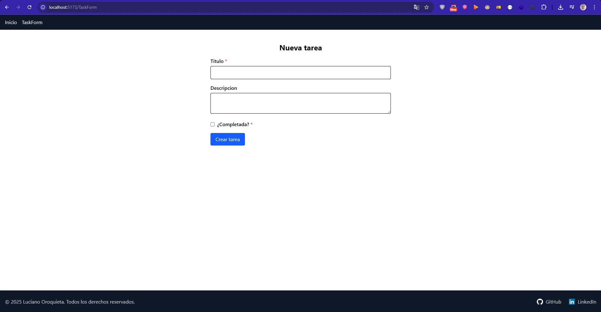

# ToDo App - Challenge Academia ForIT 2025

Aplicación básica de lista de tareas (ToDo) desarrollada para el challenge de ingreso a Academia ForIT 2025.
Incluye backend con Express + TypeScript + SQLite3 y frontend en React con Vite.

## Tecnologías utilizadas

### Backend

- Node.js
- Express
- TypeScript
- SQLite3 (con persistencia en archivo)
- `setupDb.ts` para creación automática de la base
- Controladores modularizados

### Frontend

- React + Vite
- TypeScript
- React Router (`createBrowserRouter`)
- Fetch API
- Tailwind CSS
- Variables de entorno para conectar con la API (.env)

## Instalación y ejecución

### Clonar el repositorio

```bash
git clone https://github.com/LucianoOroquietam/Challenge-Academia-ForIT-2025.git
cd forit-todo-app
```

### Instalamos dependencias y ejecutamos el backend

````bash
cd backend
npm install
npm run dev
````

Levanta el backend en `http://localhost:3000`
Crea la base de datos en `./src/db/tasks.db`
Inserta 3 tareas de prueba si está vacía

> También se puede usar `npm run seed` para hacer unos inserts de prueba

### Instalamos dependencias y ejecutamos el frontend

````bash
cd ../frontend
npm install
npm run dev
````

Levanta el frontend en `http://localhost:5173`

## Endpoints disponibles

````
GET    /tasks         --> Listar todas las tareas
GET    /tasks/:id     --> Obtener una tarea por ID
POST   /tasks         --> Crear nueva tarea
PUT    /tasks/:id     --> Editar una tarea existente
DELETE /tasks/:id     --> Eliminar una tarea
````

### Colección Postman

Para testear en postman podés importar la colección de endpoints en Postman desde:

[`/postman/forit-todo-app.postman_collection.json`](./postman/Forit.postman_collection.json)

Incluye todas las rutas disponibles para testing (GET, POST, PUT, DELETE).

## Scripts disponibles (backend)

Desde la carpeta `/backend` podés ejecutar:


| Script         | Descripción                                                |
| -------------- | ----------------------------------------------------------- |
| `npm run dev`  | Levanta el servidor con recarga automática (`ts-node-dev`) |
| `npm start`    | Ejecuta el servidor con`nodemon`                            |
| `npm run seed` | Inserta tareas de prueba en la base (`seed.ts`)             |
| `npm run lint` | Revisa el estilo del código con ESLint                     |

## Screenshots

### Base de datos SQLite3

Visualización de los registros persistidos en la tabla `tasks`:


### Lista de tareas


### Formulario de creación



### Tareas por id


### Formulario de edición


### Eliminar tarea


## Bonus implementados

- Validación de inputs en backend (campos obligatorios y tipos)
- Estructura modular: router, controller, helper, interfaz, model
- Base de datos persistente en archivo SQLite3
- Seed inicial con tareas de prueba
- Capturas de funcionamiento
- Colección Postman incluida

## 🙌 Gracias

Este proyecto fue desarrollado como parte del proceso de ingreso a **Academia ForIT 2025**.

¡Gracias por la oportunidad!
